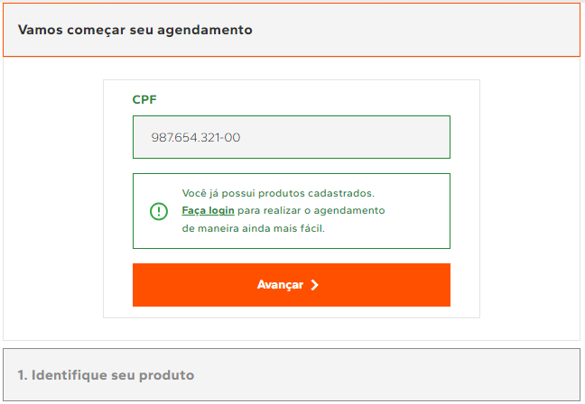
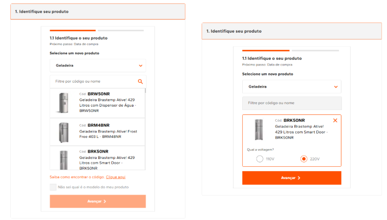
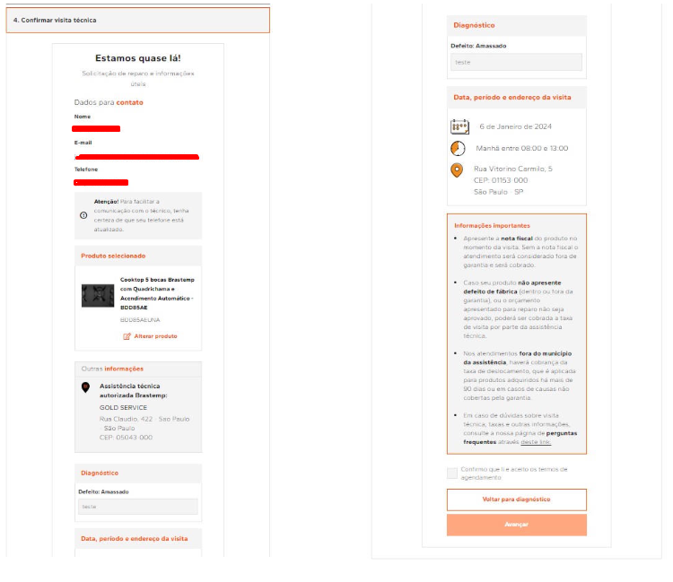

> **Author’s note**  
> This is a real-world style example of technical documentation I produced for a large consumer-brands project. It aims to **translate complexity into clarity**: what changed, why it matters, and how we implemented it. The tone stays practical and a bit colloquial—because people read better when the writing sounds like people.

# Executive Summary (TL;DR)

- **Context.** Brastemp and Consul had **three separate service request flows** each (technical visit, installation, gas conversion). By 2023, we **unified six codebases into a single, componentized codebase** that serves **both brands** and **all three flows**.
- **What changed.** We **simplified the journey**, removed unnecessary steps, enabled **login-optional** entry, and delivered **performance and UX improvements**. A **site-editor** now controls most labels and icons.
- **Why it matters.** One codebase means faster iteration, fewer defects, and consistent behavior across brands. Customers complete the journey with fewer blockers and clearer choices.
- **Outcomes (add metrics if available).**  
  - ↓ Code duplication: **6** codebases → **1**  
  - ↑ Maintainability & speed of deployment (shared components, shared logic)  
  - ↑ Task completion rate & ↓ drop-offs (fewer steps, login optional)  
  - ↑ Performance (leaner UI, fewer calls, better rule handling)
- **Scope.** Brands: **Brastemp** & **Consul**. Flows: **Technical Visit**, **Installation**, **Gas Conversion**.

---

# 1) What we had (2019–2022)

Let’s keep it simple: the old flow made customers jump through hoops. It launched around **2019**, was **login-only**, and common errors would block the request mid-journey. We also had **six separate codebases**—three per brand. That meant **fixes and features had to be built six times**, which is slow, brittle, and risky. Performance and architecture aged badly.

**Pain points**
- **Login as a gate** (no “guest” path) increased friction.  
- **Duplicated code** for each flow × brand → inconsistent behavior and slow rollouts.  
- **Frequent errors** during the journey → user frustration and support burden.  
- **Aging stack patterns** → performance and maintainability issues.

---

# 2) What we changed (2023 rollout)

We **rebuilt the entire journey** and released it **phased**: first Brastemp, then Consul. We introduced a **fresh visual identity**, **shorter paths**, **login-optional entry**, and a **single codebase** with **shared, brand-agnostic components**. New features or bug fixes now land **once** and immediately benefit **all flows** across **both brands**. Labels and icons are **editable** via the site-editor.

**Highlights**
- **Single codebase** for Brastemp + Consul and all three flows.  
- **Login optional**: people can request without an account.  
- **Lean steps**: removed non-essential steps, condensed decisions.  
- **Editable UI copy & icons** via site-editor (no redeploy for wording tweaks).  
- **Faster, more consistent delivery**: one place to implement & test.

---

# 3) Journey Anatomy (Public & Logged-in)

Below is the **canonical flow** shared across brands and use-cases. Where behavior differs (e.g., logged-in vs guest), rules note that explicitly.

## Pre-Step — **CPF Capture** (guests only)

**Goal.** Capture **CPF** (Brazilian tax ID) to check if a person has a **VTEX** account and **registered products**. If yes, we encourage a **quick login** to speed things up.

**Rules**
- Visible **only** to **logged-out** users.  
- **CPF is required** to proceed.  
- With the CPF we check: **VTEX account** + **registered products**.  
- If both exist → show a **login incentive card**.  
- If only the VTEX account exists (no products) → no card here, but we’ll surface a login incentive in **Personal Data** and **Addresses** later (no re-requests needed).  
- The user **can skip login** and **continue as guest**.  
- If they continue as guest, **store CPF** for reuse in later steps.

---

## Step 1 — **Identify Your Product**

**Goal.** Select the product for which we’ll open the service order.

**Options**
- Use the category & model selectors (_“Don’t know the code?” offers a small helper_).  
- If **logged-in** and products are registered → show a **product list** first. Picking from the list **hides** the category/code selector.

**Rule-of-thumb UX**
- Keep most common paths top-of-screen.  
- Provide a path for uncertainty (“How to find my model?”).

---

## Step 2 — **Data for Scheduling**

This step has **three sub-steps**.

### 2.1 Personal Data

- **Guest:** fill the form. On CPF entry, we validate and, if CPF exists in VTEX, we display a **“You already have an account”** nudge to log in.  
- **Logged-in:** if all personal data fields are present in the account, we **skip** to **Addresses**. Otherwise, fill the missing fields. Updates are **saved** to VTEX and **synced** to **CRM**.

**Rules**
- **Personal data required** to proceed.  
- **Logged-in with full data:** jump straight to **2.2 Address**.  
- **Guest + existing CPF in VTEX:** show login suggestion box.  
- If the user logs in from here, **return to Step 2** with the **selected product preserved**.  
- Form fields **unlock after CPF** is provided.  
- If logged-in and personal data exist, **CPF and email are locked** (non-editable).

### 2.2 Address

- **Guest:** fill the address form and proceed.  
- **Logged-in:** see **all saved addresses**, select one or **add a new** address.

**Rules**
- For guests, typing a **CEP** triggers a **ViaCEP** lookup; fields returned from the API are **auto-filled** and **locked**.  
- Logged-in users see a **list of addresses** (street, number, complement, neighborhood, ZIP/CEP, city, state).  
- If no addresses exist, show **empty-state messaging**.  
- The **Continue** button is enabled after adding a new address or selecting one.  
- Users can **go back** to Personal Data at any time.  
- **Source of truth:** addresses come from **CRM** (not VTEX).

### 2.3 Scheduling

Pick a **date** and **time window**, confirm that you’ve read the terms, and proceed. There are **three scenarios**:

1) **Normal** — pick date & period, accept terms, continue.  
2) **No slots available** — the service center has no dates; we **redirect to Step 3 (Diagnosis)**.  
3) **No service center** — the user’s area has no coverage; we show an **error screen** with guidance.

**Rules**
- Date must be chosen **before** a time period becomes selectable.  
- **Terms checkbox** is required; show **error state** if missing.  
- Show the **assigned service center** card (except for center IDs **94629** or **94923**, where the card is hidden).  
- Show a **“Useful Information”** card for clarity.  
- Back navigation to **Address** is supported.

---

## Step 3 — **Diagnosis**

The goal here is to **understand or even solve** the problem before sending a technician.

There are **two paths**:

- **With Troubleshooting Tree** (if available for the product): the user follows a guided decision tree to try solving the issue.  
  - They can **exit the tree at any time** and continue to schedule.  
  - If they **resolve** the issue by the end of the tree, an **OS (service order)** is **generated**, a **summary** is shown, and **earlier steps become locked** (since we’re done).  
  - If they still want a visit, a **details textarea** is available (optional).

- **Without Troubleshooting Tree:** the user **selects a problem** from a list and must **describe** it to proceed.

**Special cases**
- If a product has **no defects list**, show an **error screen**.  
- For **Installation** and **Gas Conversion** flows:  
  - Show **technical requirements** text.  
  - Require **acceptance of terms**.  
  - **No problem-details textarea** in these flows.

---

## Step 4 — **Summary**

Final review before sending the request. The user sees **contact data**, **selected product**, **authorized service center**, **diagnosis**, and **appointment details**, plus **important information** (fees, warranties).

**Rules**
- **Contact data** (name, email, phone) with **Edit** button.  
- **Selected product** with an option to **Change product** (note: **changing product resets the entire flow**).  
- **Authorized service center** card (hidden for IDs **94629** or **94923**).  
- **Date, time period, and address** cards.  
- **Important information** card.  
- **Terms acceptance** required (error if missing).  
- Back navigation to **Diagnosis** allowed.  
- On **Continue**, we **generate the OS** and redirect to **Confirmation**.

---

## Confirmation — **Request Submitted**

A clear confirmation screen shows the **OS number** and a **feedback module** so customers can rate the journey.

**Rules**
- Show **confirmation** and **OS number**.  
- **Feedback area**: satisfaction selection and “what could be improved” are **required**; comments are **optional**.  
- On submit, show **“Feedback sent successfully.”**  
- For **AT Estrela** cases, display a notice that the user **must contact the service center** to complete scheduling.

---

## Errors — **Blocking Issues**

We consolidate blocking errors into a dedicated error view with clear codes and next steps.

**Examples**
- **002** — Error creating/updating the consumer.  
- **003** — Error fetching the product problem list.  
- **004** — Error creating/updating appliances and addresses.  
- **006** — Error fetching scheduling services.  
- **007** — No authorized service center for the customer’s area.  
- **(No code)** — Error creating the service order.

---

# 4) Technical Overview

**Stack & Patterns**
- **React** (Function Components), **TypeScript**, **Hooks**.  
- **GraphQL** via **react-apollo**, with **clients** and **resolvers** pattern.  
- **Tachyons** + **CSS Handles** for styling hooks and brand overrides.

**Single Codebase, Many Flows**
- All flow components are **generic and reuse-first** across the three flows (technical visit, installation, gas conversion) **and** both brands (Brastemp & Consul).  
- Outcome: **no duplicated code**, **consistent behavior**, **faster deployments**, and **less regression risk**.

**Brand Styling**
- Components ship with **neutral base styles** (Tachyons).  
- **Brand identity** (colors, spacing, assets) is applied by the **importing repository** via **CSS Handles**.  
- This makes core logic **brand-agnostic** and easy to extend.

**Data & Integrations**
- **VTEX**: accounts, products, and site-editor content.  
- **CRM**: addresses are sourced here (not from VTEX).  
- **ViaCEP**: address lookup and autofill from CEP.  
- **API keys** are managed **exclusively in VTEX Admin**, not hard-coded.

**Repositories**
- Code is organized by **core flow** and **brand shells**.  
- Repository names and endpoints are **omitted here**; in a private setting I can provide the exact map.

---

# 5) Operations & Content

- **Site-editor** controls a large portion of **texts and icons** so content teams can iterate **without deploys**.  
- Feature toggles and copy changes are **safer** and **faster** to ship.

---

# 6) Results & Next Steps

Even without sharing sensitive numbers, the architecture changes are clear: **less code to maintain, faster to evolve, less room for error, and a smoother customer journey**.

**If you can disclose metrics, plug them here:**
- Conversion uplift or drop-off reduction (login optional; shorter path).  
- Performance wins (load time, API calls, perceived speed).  
- Time-to-market improvements (deploy frequency, lead time).  
- Support impact (fewer tickets for known blockers).

**Future improvements (nice-to-haves)**
- Inline **progress indicators** with step estimates.  
- **A/B tests** for copy and branching logic.  
- **Proactive availability** previews based on location + product.  
- **Accessibility** audits for keyboard & screen readers.

---

## Glossary

- **CPF**: Brazilian taxpayer number (ID).  
- **VTEX**: Commerce platform used for identity, products, and admin.  
- **ViaCEP**: Public API for Brazilian postal code lookups.  
- **OS**: Service Order (Ordem de Serviço).  
- **AT Estrela**: Internal partner tier; some bookings require direct contact.  
- **ASC**: Authorized Service Center.

---

## How to Read This Sample

This document is intentionally **hybrid**: it’s detailed enough for engineers, but written so **non-technical stakeholders** can follow the logic and value. If you prefer a **2-page executive cut**, I can deliver that too.
